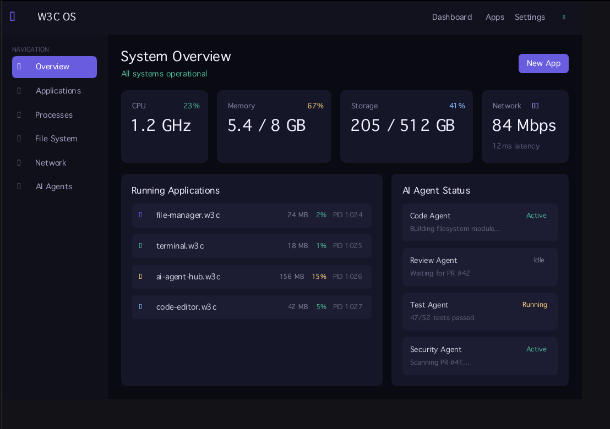

# W3C OS

[CI](https://github.com/wangnaihe/w3cos/actions/workflows/ci.yml)
[Build ISO](https://github.com/wangnaihe/w3cos/actions/workflows/build-iso.yml)
[License](LICENSE)
[Rust](https://www.rust-lang.org)

**An AI-native operating system and application runtime built on W3C standards. TypeScript + DOM run as native code, without embedding Chromium or V8.**



```
app.ts  →  w3cos build  →  native binary (2.4 MB)
```

## What is this?

W3C OS is a native Web application platform and Linux-based operating system where:

- Applications use **standard W3C DOM + CSS** (the same APIs as the Web)
- TypeScript can be compiled **ahead of time to native machine code** via
  Rust/LLVM, while dynamic browser-style documents use the shared W3IR/W3VM
  semantic core
- AI agents can **read and operate every UI element** directly through the DOM — no screenshot guessing
- The system boots from a **minimal Linux kernel** directly into the W3C OS Shell

Write Web-standard code. Get native performance. Give AI full visibility.

Implementation status is tracked per engine and target in the
[Web API capability matrix](WEB_API_CAPABILITIES.md); planned work and exit
gates live in the [roadmap](ROADMAP.md).

## Current milestone

The current `main` milestone is **native Web UI semantic parity**. The latest
baseline expands the real DOM/CSSOM path, stylesheet matching, Flexbox/Grid
layout, Fetch response streams, object-URL images, SVG rendering, native
hit-testing and form-control behavior. Mobile generation now covers Android,
iOS, and HarmonyOS, with incremental generated modules and an iOS native text
and file-input bridge.

This is active implementation, not a browser-conformance claim. Physical-device
lifecycle, complete mobile gesture arbitration, host-backed device APIs, and
the formal downstream application gates remain open. See the
[capability matrix](WEB_API_CAPABILITIES.md) for exact per-target boundaries.

## Quick Start

```bash
# Install Rust
curl --proto '=https' --tlsv1.2 -sSf https://sh.rustup.rs | sh

# Clone and build
git clone https://github.com/wangnaihe/w3cos.git
cd w3cos
cargo build --release

# Compile a TypeScript app to a native binary
./target/release/w3cos build examples/showcase/app.tsx -o showcase --release
./showcase    # Opens a native window — no browser involved
```

## Mobile (Android / iOS / HarmonyOS)

Native **shell + AOT app** — generic platform, no product-specific examples.

```bash
# Desktop dev (same TSX pipeline)
w3cos build examples/mobile-demo/app.tsx -o mobile-demo --release

# Scaffold all platform shells
w3cos mobile init MyApp --platform all
```

See [docs/MOBILE.md](docs/MOBILE.md).

## Example

### TSX + npm ESM

```tsx
import { useState } from "react"

function App() {
  const [count, setCount] = useState(0)
  return (
    <div style={{ gap: 20, padding: 48, alignItems: "center", backgroundColor: "#0f0f1a" }}>
      <span style={{ fontSize: 42, color: "#e94560" }}>W3C OS</span>
      <span style={{ fontSize: 20, color: "#a0a0b0" }}>Native TSX, compiled AOT.</span>
      <button onClick={() => setCount(count + 1)}>Count: {count}</button>
    </div>
  )
}

export function main() {
  return <App />
}
```

The compiler lowers standard JSX and npm ESM dependencies directly to Rust. Hooks are ordinary package imports; there is no framework-specific runtime path.

```bash
$ w3cos build app.tsx -o myapp --release
⚡ Transpiling TS → Rust... done
🔨 Compiling native binary... done
✅ Output: ./myapp (2.4 MB)
```

## Why?


|                | Electron         | React Native    | Flutter     | **W3C OS**           |
| -------------- | ---------------- | --------------- | ----------- | -------------------- |
| Binary Size    | 90+ MB           | 30+ MB          | 15+ MB      | **2.4 MB**           |
| RAM Usage      | 200+ MB          | 100+ MB         | 80+ MB      | **~15 MB**           |
| Startup        | 2-5 sec          | 1-3 sec         | 0.5-2 sec   | **< 100ms**          |
| Language       | JS (V8 JIT)      | JS (Hermes)     | Dart (AOT)  | **TS (native AOT)**  |
| Runtime        | Chromium         | Bridge + Native | Dart VM     | **Native Rust (AOT/W3VM)** |
| DOM API        | ✅ (browser only) | ❌               | ❌           | **✅ (system-wide)**  |
| AI reads UI    | Screenshot       | Screenshot      | Screenshot  | **DOM tree (< 1ms)** |
| Standard       | Proprietary      | Proprietary     | Proprietary | **W3C**              |
| Installable OS | ❌                | ❌               | ❌           | **✅**                |


## AI-Native: Why This Matters

Traditional operating systems are **opaque to AI** — an AI agent must take screenshots and guess what's on screen (slow, expensive, fragile).

W3C OS applications are built with the DOM. AI agents **read the DOM tree directly**:

```
Traditional OS:  AI sees pixels → vision model → guess UI → click coordinates (1-3 sec, $$$)
W3C OS:          AI reads DOM  → structured tree → precise action (< 1ms, free)
```

Three access levels for AI agents:

- **Layer 1 — DOM Access**: Read/write any element, trigger events. 100% precise. < 1ms.
- **Layer 2 — Accessibility Tree**: ARIA-compliant summary. Minimal tokens for LLMs.
- **Layer 3 — Annotated Screenshot**: For Claude Computer Use / UI-TARS compatibility.

## Install as an OS

W3C OS can boot as a standalone operating system — directly into the W3C OS Shell.

### Build the bootable ISO

```bash
# Prerequisites (Linux): build-essential, ncurses-dev, wget, python3
# On macOS, the script will automatically use Docker for cross-compilation.

./system/scripts/build-iso.sh    # Output: w3cos.iso (~50-100 MB)
```

### Run

```bash
# Option 1: QEMU virtual machine
qemu-system-x86_64 -cdrom w3cos.iso -m 2G -vga virtio

# Option 2: Flash to USB and boot real hardware
sudo dd if=w3cos.iso of=/dev/sdX bs=4M status=progress

# Option 3: Docker (compile apps, no GUI)
docker build -t w3cos . && docker run w3cos --help

# Option 4: GitHub Codespaces (one-click dev environment)
# Click "Open in Codespaces" on the GitHub repo page
```

See [system/INSTALL.md](system/INSTALL.md) for the full installation guide.

## How It Works

```
TypeScript / JavaScript / TSX + DOM + CSS
        ├─ AOT: SWC → generated Rust → rustc/LLVM → native binary
        └─ Dynamic document: SWC → W3IR → W3VM
                         ↓
          Shared Value / Promise / DOM / Web API semantics
                         ↓
       Native layout, rendering, input, and platform hosts
```

### Generate Web API skeletons

Generate reviewable Rust facade scaffolding from a TypeScript declaration file:

```bash
w3cos web-api-skeleton path/to/lib.dom.d.ts \
  --interface Event \
  --interface Navigator \
  --output web_api_stubs.rs
```

Inherited interface members are included by default; pass `--own-only` to emit
only directly declared members. Generated constructors, methods, getters, and
setters contain named `todo!()` placeholders and are not wired into the runtime
automatically.

### Audit the live Chromium Web API surface

Compare the Web API globals and constructor prototypes exposed by a locally
installed Chrome/Chromium with the current w3cos `window`:

```bash
w3cos web-api-audit
w3cos web-api-audit --json
w3cos web-api-audit --fail-on-missing
```

Use `--chrome /path/to/chrome` when auto-detection is unavailable. The audit
filters ECMAScript built-ins and event-handler properties, but intentionally
keeps experimental browser interfaces visible so roadmap decisions do not
mistake an omitted subsystem for conformance.

### Technology Stack


| Layer        | Technology                                                                                                    | What it does                   |
| ------------ | ------------------------------------------------------------------------------------------------------------- | ------------------------------ |
| CSS Layout   | [Taffy](https://github.com/DioxusLabs/taffy) 0.9                                                              | Flexbox, Grid, Block, position |
| Text Layout  | [Parley](https://github.com/linebender/parley)                                                                | Line-breaking, shaping, bidi   |
| 2D Rendering | Skia (primary), Vello/tiny-skia compatibility backends                                                  | Raster and vector graphics     |
| Windowing    | [winit](https://github.com/rust-windowing/winit)                                                              | Cross-platform native windows  |
| OS Base      | Linux kernel (Debian Minimal / Buildroot)                                                                     | Drivers, processes, filesystem |


## CSS support snapshot

The table below is a high-level native rendering snapshot. It does not replace
the per-surface and per-target qualifications in
[WEB_API_CAPABILITIES.md](WEB_API_CAPABILITIES.md).


| Feature                                 | Status |
| --------------------------------------- | ------ |
| Flexbox / Grid                          | ✅ Full |
| Block layout                            | ✅      |
| `position: relative / absolute`         | ✅      |
| `position: fixed / sticky`              | ✅      |
| `overflow: hidden / scroll`             | ✅      |
| `z-index`                               | ✅      |
| Units: `px, %, rem, em, vw, vh`         | ✅      |
| `border-radius`, `opacity`              | ✅      |
| `box-shadow`                            | ✅      |
| `transform: translate / scale / rotate` | ✅      |
| `transition` (easing functions)         | ✅      |
| `@keyframes` animation                  | ✅      |
| `display: inline / inline-block`        | ✅      |
| `@layer` cascade layers                 | ✅      |
| `@media` queries                        | ✅      |
| Container Queries                       | ✅      |
| Pseudo-classes (`:hover`, `:focus`, `:nth-child`, etc.) | ✅ |
| Attribute selectors (`[attr=value]`)    | ✅      |
| CSS Custom Properties (`var(--x)`)      | ✅      |
| Mouse events (hover, click)             | ✅      |


## Project Structure

```
w3cos/
├── crates/
│   ├── w3cos-core/        # JS-compatible Value type, reactive system, Proxy
│   ├── w3cos-ir/          # Versioned shared JavaScript IR
│   ├── w3cos-vm/          # Dynamic W3IR execution backend
│   ├── w3cos-std/         # Type definitions (Style, Component, Color)
│   ├── w3cos-dom/         # W3C DOM API (Document, Element, Events)
│   ├── w3cos-a11y/        # Accessibility tree (ARIA, for AI + screen readers)
│   ├── w3cos-ai-bridge/   # AI agent interface (3-layer access + permissions)
│   ├── w3cos-compiler/    # TS → Rust transpiler (SWC parser + CSS/SCSS)
│   ├── w3cos-runtime/     # Layout + Rendering + Window + System APIs
│   ├── w3cos-cli/         # CLI: w3cos build / run / dev / init / mobile
│   ├── w3cos-mobile/      # Mobile host contracts and platform bridges
│   ├── w3cos-ffi/         # Native library and C ABI bridge
│   ├── w3cos-shell/       # System-level desktop shell binary
│   ├── w3cos-demo/        # Showcase demo binary
│   └── w3cos-rn-compat/   # React Native API compatibility layer
├── templates/
│   ├── android/           # Gradle + NativeActivity shell
│   ├── ios/               # Xcode/UIKit shell
│   ├── harmony/           # ArkUI/XComponent shell scaffold
│   └── shared/            # app.tsx + w3cos.app.json starter
├── docs/MOBILE.md         # Mobile build guide
├── system/
│   ├── buildroot/         # Bootable ISO config
│   ├── rootfs_overlay/    # System init scripts
│   ├── scripts/           # build-iso.sh, run-qemu.sh
│   └── INSTALL.md         # Installation guide
├── examples/              # 18+ example applications
├── .openclaw/             # OpenClaw + Lobster AI workflow configs
├── .devcontainer/         # One-click dev environment
├── Dockerfile             # Container build
├── ARCHITECTURE.md        # Full architecture document
├── AI_DEVELOPMENT.md      # AI-driven development model
├── ROADMAP.md             # Phased development plan
└── CONTRIBUTING.md        # How to contribute (AI + humans)
```

## AI-Driven Development

W3C OS is built by AI agents, directed by humans.

```
Humans file Issues  →  Management AI triages  →  Contributor AI codes  →  Human approves
```

- **Humans**: File Issues, review PRs, make architecture decisions, sponsor tokens
- **AI (Management)**: Triage issues, review PRs, run CI, manage releases
- **AI (Contributor)**: Pick up `ai-ready` issues, implement features, write tests, submit PRs

AI tokens are funded by community sponsors. Every dollar goes to AI compute.

See [AI_DEVELOPMENT.md](AI_DEVELOPMENT.md) for the full model, and [CONTRIBUTING.md](CONTRIBUTING.md) to get involved.

## Sponsor

AI agents need tokens. Your sponsorship keeps development moving.

[Sponsor](https://github.com/sponsors/wangnaihe)


| Tier     | Amount  | Impact                            |
| -------- | ------- | --------------------------------- |
| Byte     | $5/mo   | ~1 AI-implemented issue/month     |
| Kilobyte | $25/mo  | ~5 AI-implemented issues/month    |
| Megabyte | $100/mo | ~20 AI-implemented issues/month   |
| Gigabyte | $500/mo | Sustained AI development capacity |


100% goes to AI compute. No human salaries. Fully transparent.

## License

Apache 2.0 — open, neutral, not controlled by any single corporation.
